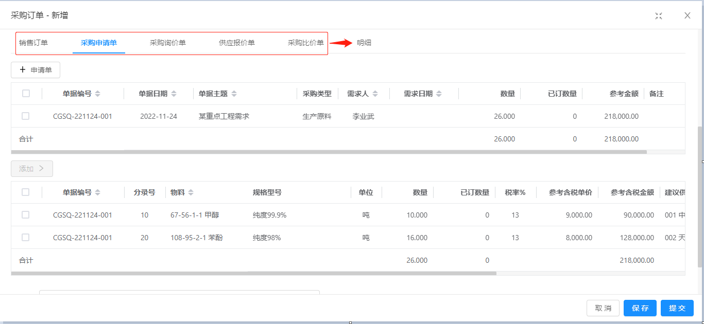

Finer 进销存系统
===============

当前最新版本： 1.0.0（发布日期：2022-11-22）


[]()
[]()
[]()

升级说明：v1.0.0对v0.5.0做了重大重构，难于平滑升级！！！

介绍
-----------------------------------
Finer 进销存系统是一款面向中小企业的管理软件，基于十多年的中小企业管理经验，由ERP领域的资深专家分析设计；
基于J2EE快速开发平台Jeecg-Boot开发，前后端分离架构SpringBoot2.x、Ant Design&Vue、Mybatis-plus、Shiro、JWT；
具有方便快捷的定制和二次开发能力，在Jeecg-Boot支撑下，利用其强大的代码生成器，无需写任何代码就可以快速实现大多功能，
也可手工加入复杂的业务逻辑，快速满足中小企业灵活多样的个性化需求！

Finer 进销存的社区版和商业版：
 - 社区版：实现进销存业务的结果管理，直接出入库并自动生成应收应付，进行收付款并自动核销应收应付。
 - 商业版：实现进销存业务的全过程管理，包括从申请、询价、报价、比价、订单开始的业务全过程，
 自动跟踪单据的处理情况，实时反映库存情况、客户欠款和欠供应商款等，集成钉钉等第三方审批系统。

演示
-----------------------------------
 http://39.106.43.40
 - 用户名：admin
 - 密　码：123456
 - 浏览器：谷歌 Chrome、火狐 Firefox、360浏览器（不建议IE）
 - 说　明：为配合演示，需要BPM审批的单据，我们会在钉钉尽快处理，您稍后重新查询单据列表即可看到审批结果。
 如果我们未能及时处理，或因其它原因未能及时看到审批完成，您可使用独立权限控制的【结束审批】功能代替钉钉审批。

功能模块
-----------------------------------
```
┌─销售管理
│  ├─销售报价
│  ├─销售订单
│  └─销售统计
│     ├─销售订单执行情况
│     ├─销售订单毛利润
│     ├─销售订单汇总
│     ├─销售订单汇总-部门
│     ├─销售订单汇总-业务员
│     ├─销售订单汇总-客户
│     └─销售订单汇总-物料
├─采购管理
│  ├─采购申请
│  ├─采购询价
│  ├─采购报价
│  ├─采购比价
│  ├─采购订单
│  ├─采购预付申请
│  ├─采购付款申请
│  └─采购统计
│     ├─采购订单执行情况
│     ├─采购订单汇总
│     ├─采购订单汇总-部门
│     ├─采购订单汇总-业务员
│     ├─采购订单汇总-供应商
│     └─采购订单汇总-物料
├─库存管理
│  ├─入库管理
│  │  ├─采购入库：自动生成采购应付
│  │  ├─采购退货出库：自动生成红字采购应付
│  │  ├─盘盈入库
│  │  ├─涨吨入库
│  │  └─其他入库
│  ├─出库管理
│  │  ├─销售出库：自动生成销售应收
│  │  ├─销售退货入库：自动生成红字销售应收
│  │  ├─盘亏出库
│  │  └─其他出库
│  ├─其他管理
│  │  ├─库存调拨
│  │  ├─成本调整
│  │  └─库存盘点
│  ├─即时库存
│  │  ├─物料库存
│  │  ├─物料批次库存
│  │  ├─出库物料库存
│  │  └─详细库存
│  └─出入库统计
│     ├─出入库月汇总
│     ├─出入库日汇总
│     └─出入库明细
├─应收与收款 
│  ├─应收管理
│  │  ├─销售应收
│  │  ├─其他应收
│  │  └─应收核销
│  ├─预收管理
│  │  ├─销售预收
│  │  └─其他预收
│  ├─收款管理
│  │  ├─销售收款：自动生成应收核销
│  │  ├─销售退货退款申请
│  │  ├─销售退货退款(有申请)：自动生成应收核销
│  │  ├─销售退货退款(无申请)：自动生成应收核销
│  │  └─其他收款
│  └─应收统计
│     ├─应收对账
│     ├─应收明细
│     ├─应收月汇总
│     └─应收即时余额
├─应付与付款 
│  ├─应付管理
│  │  ├─采购应付
│  │  ├─其他应付
│  │  └─应付核销
│  ├─预付管理
│  │  ├─采购预付(有申请)
│  │  ├─采购预付(无申请)
│  │  ├─其他预付申请
│  │  ├─其他预付(无申请)
│  │  └─其他预付(无申请)
│  ├─付款管理
│  │  ├─采购付款(无申请)：自动生成应付核销
│  │  ├─采购付款(有申请)：自动生成应付核销
│  │  ├─采购退货退款：自动生成应付核销
│  │  ├─其他付款申请
│  │  ├─其他付款(有申请)
│  │  └─其他付款(无申请)
│  └─应付统计
│     ├─应付对账
│     ├─应付明细
│     ├─应付月汇总
│     └─应付即时余额
├─发票登记
│  ├─销售发票
│  ├─销售发票(红冲)
│  ├─销售发票(退货)
│  ├─采购发票
│  ├─采购发票(红冲)
│  └─采购发票(退货)
├─基础资料 
│  ├─客户、供应商
│  ├─仓库、物料分类、物料、计量单位
│  ├─银行账户、币种
│  └─审批定义
├─业务监控 
│  ├─审批信息
│  ├─月度结账
│  └─单据选项：单据可设置为需审核、审批、不核批
│
├─系统管理（JeecgBoot功能）
│  ├─用户管理
│  ├─角色管理
│  ├─菜单管理
│  ├─权限设置（支持按钮权限、数据权限）
│  ├─表单权限（控制字段禁用、隐藏）
│  ├─部门管理
│  ├─字典管理
│  ├─职务管理
│  └─通讯录
├─代码生成器（JeecgBoot功能）
│  ├─代码生成器功能（一键生成前后端代码，生成后无需修改直接用，绝对是后端开发福音）
│  ├─代码生成器模板（提供4套模板，分别支持单表和一对多模型，不同风格选择）
│  ├─代码生成器模板（生成代码，自带excel导入导出）
│  ├─查询过滤器（查询逻辑无需编码，系统根据页面配置自动生成）
│  ├─高级查询器（弹窗自动组合查询条件）
│  ├─Excel导入导出工具集成（支持单表，一对多 导入导出）
│  └─平台移动自适应支持
├─系统监控（JeecgBoot功能）
│  ├─Gateway路由网关
│  ├─性能扫描监控
│  │  ├─监控 Redis
│  │  ├─Tomcat
│  │  ├─jvm
│  │  ├─服务器信息
│  │  ├─请求追踪
│  │  └─磁盘监控
│  ├─定时任务
│  ├─系统日志
│  ├─数据日志（记录数据快照，可对比快照，查看数据变更情况）
│  ├─SQL监控
│  └─swagger-ui(在线接口文档)
├─Online在线开发（JeecgBoot功能）
│  ├─Online在线表单 - 功能已开放
│  ├─Online代码生成器 - 功能已开放
│  ├─Online在线报表 - 功能已开放
│  ├─Online在线图表(未开源)
│  ├─Online图表模板配置(未开源)
│  ├─Online布局设计(未开源)
│  └─多数据源管理 - 功能已开放
└─积木报表设计器（JeecgBoot功能）
   ├─打印设计器
   ├─数据报表设计
   ├─图形报表设计（支持echart）
   └─大屏设计器(未开源)
```
   
系统效果
----
##### 登录

##### 首页

##### 采购订单

##### 采购订单 - 编制和自定义列

##### 采购订单 - 源单

##### 销售订单 - 执行情况

##### 销售订单 - 毛利润

##### 销售业务员业绩

##### 单据审批 - 手机钉钉

##### 单据打印


 
技术架构
-----------------------------------
#### 开发环境
- 语言：Java 8+ (小于17)
- IDE(JAVA)： IDEA (必须安装lombok插件 )
- IDE(前端)： Vscode、WebStorm、IDEA
- 依赖管理：Maven
- 缓存：Redis
- 数据库脚本：MySQL5.7+（其他数据库，[需要自己转](https://my.oschina.net/jeecg/blog/4905722)）

#### 后端
- 基础框架：Spring Boot 2.6.6
- 微服务框架： Spring Cloud Alibaba 2021.0.1.0
- 持久层框架：MybatisPlus 3.5.1
- 报表工具： JimuReport 1.5.2
- 安全框架：Apache Shiro 1.8.0，Jwt 3.11.0
- 微服务技术栈：Spring Cloud Alibaba、Nacos、Gateway、Sentinel、Skywalking
- 数据库连接池：阿里巴巴Druid 1.1.22
- 日志打印：logback
- 其他：autopoi, fastjson，poi，Swagger-ui，quartz, lombok（简化代码）等。

#### 前端
- 基础框架：[ant-design-vue](https://github.com/vueComponent/ant-design-vue) - Ant Design Of Vue 实现
- JavaScript框架：Vue
- node
- yarn
- @vue/cli 3.2.1
- [vue-cropper](https://github.com/xyxiao001/vue-cropper) - 头像裁剪组件
- [@antv/g2](https://antv.alipay.com/zh-cn/index.html) - Alipay AntV 数据可视化图表
- [Viser-vue](https://viserjs.github.io/docs.html#/viser/guide/installation)  - antv/g2 封装实现
- [Vue 2.6.10](https://cn.vuejs.org/),[Vuex](https://vuex.vuejs.org/zh/),[Vue Router](https://router.vuejs.org/zh/)
- [Axios](https://github.com/axios/axios)
- [webpack](https://www.webpackjs.com/),[yarn](https://yarnpkg.com/zh-Hans/)
- eslint，[@vue/cli 3.2.1](https://cli.vuejs.org/zh/guide)
- vue-print-nb-jeecg - 打印


开发环境搭建
----
### 前端环境
#### 安装node.js
如果未安装Node.js，请安装它。
```bash
# 验证
# 出现相应npm版本即可
npm -v
# 出现相应node版本即可
node -v
```
#### 安装yarn
```bash
# 全局安装yarn
npm i -g yarn
# 验证
# 出现对应版本号即代表安装成功
yarn -v 
```

#### 配置镜像
```bash
npm config set registry https://registry.npm.taobao.org --global
npm config set disturl https://npm.taobao.org/dist --global

yarn config set registry https://registry.npm.taobao.org --global
yarn config set disturl https://npm.taobao.org/dist --global
```

### JAVA开发环境
- node-v12.16.0-x64.msi
- yarn-1.21.1.msi
- ideaIU-2019.2.3.exe
- jdk-8u191-windows-x64.exe
- apache-maven-3.5.4.zip
- redis64-3.0.501
- mysql-5.7.26-winx64.zip

项目下载和运行
----
- 拉取项目代码
```bash
git clone https://gitee.com/FINERME/psi.git
cd  psi/ant-design-vue-jeecg
```
- 安装依赖
```bash
yarn install
```
- 开发模式启动
```bash
yarn run serve
```
- 编译项目
```bash
yarn run build
```
- Lints and fixes files
```bash
yarn run lint
```

其他说明
----
jeecg-Boot技术官网： http://www.jeecg.com

jeecg-Boot开发文档： http://doc.jeecg.com

捐赠
----
如果您觉得本项目还可以，请点个star~，也可以请作者喝杯咖啡 ^_^ 
